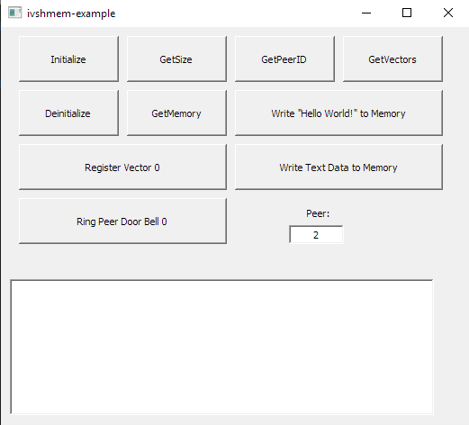

	ivshmem-example
	===============

This project is a Qt example for Windows (tested only on Windows 10) that allow you to test the Shared Memory on a QEMU VM guest.

Installation (Host side)
========================

On Linux you have to:
* start the ivshmem_server 
* add to your QEMU VM: -chardev socket,path=/tmp/ivshmem_socket,id=ivshmem_socket -device ivshmem-doorbell,chardev=ivshmem_socket,vectors=1 

Installation (VM side)
========================

Windows will not prompt for a driver for the IVSHMEM device, instead it will use a default null (do nothing) driver for the device. To install the IVSHMEM driver you will need to go into device manager and update the driver for the device "PCI standard RAM Controller" under the "System Devices" node.

A signed Windows 10 driver can be obtained from Red Hat for this device from the below address:

https://fedorapeople.org/groups/virt/virtio-win/direct-downloads/upstream-virtio/

Please note that you must obtain version 0.1.161 or later

Usage (VM side)
========================

Thanks to
========================

Looking Glass - KVM FrameRelay (KVMFR) Client
Geoffrey McRae <geoff@hostfission.com>
https://looking-glass.hostfission.com
